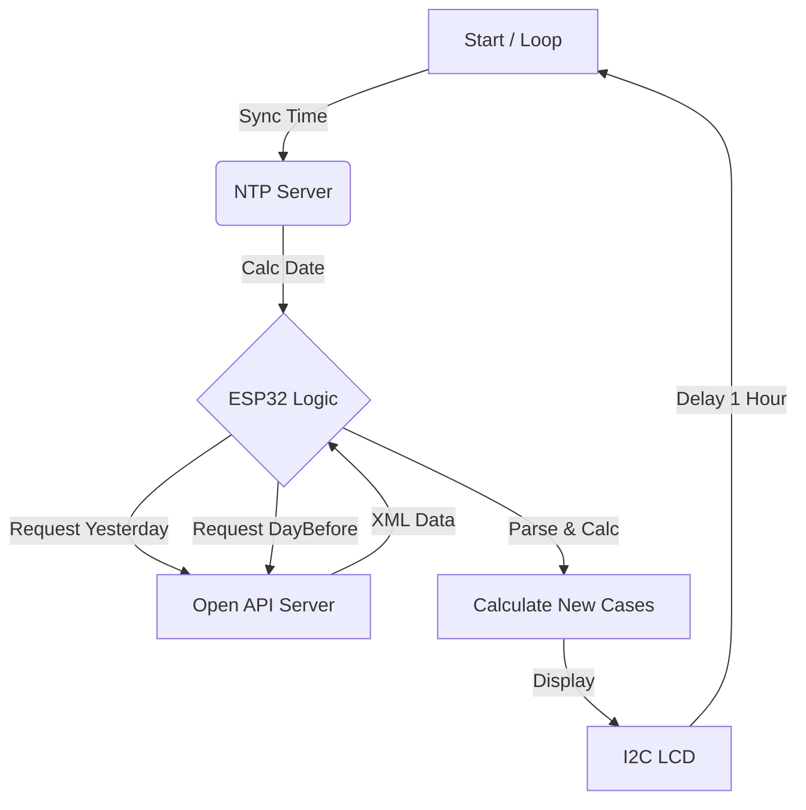

# 🌡️ ESP32 기반 코로나19 실시간 알리미 (IoT Project)


> **"오늘의 코로나 확진자 수를 자동으로 알려줍니다."**
> <br/>공공데이터포털 API와 NTP 시간 서버를 활용한 실시간 정보 시각화 IoT 디바이스

<br/>

## 📸 프로젝트 시연


<br/>

## 🛠 시스템 구조 (Architecture)


<br/>

## 📌 기획 의도 및 핵심 기능

* **문제 정의:** 매일 스마트폰으로 확진자 수를 검색해야 하는 번거로움을 해소하고, 공공장소에서 직관적으로 정보를 제공하고자 함.
* **핵심 기능:**
    * 🕒 **NTP 시간 동기화 및 자동 날짜 계산**
        * 물리적인 RTC(Real Time Clock) 모듈 없이 `pool.ntp.org` 서버와 통신하여 정확한 시각 동기화
        * `time.h` 라이브러리의 `mktime`을 활용해 월말/연말(Rollover) 시점의 '어제'와 '그제' 날짜를 자동으로 역산
    * 📶 **Open API 데이터 실시간 파싱**
        * 공공데이터포털의 XML 데이터를 수신하여 임베디드 환경에 최적화된 **경량 파싱 알고리즘** 적용
        * 무거운 JSON/XML 라이브러리를 사용하지 않고, 필요한 태그(`<decideCnt>`)만 스트림 방식으로 추출하여 메모리 효율 극대화
    * 🧮 **신규 확진자 산출 로직 (Differential Calculation)**
        * API가 '누적 확진자 수'만 제공하는 한계를 극복하기 위해 **(어제 누적 - 그제 누적)** 차분 알고리즘 구현
        * 1시간(3600초)마다 데이터를 자동 갱신하여 최신 정보 유지
    * 🖥️ **I2C LCD 정보 시각화**
        * 16x2 LCD를 통해 계산된 신규 확진자 수를 직관적인 포맷(`Covid-19: +NNN`)으로 출력

<br/>

## ⚡ 기술적 도전 및 해결 (Troubleshooting)

### 1. 날짜 계산 알고리즘 구현
* **Issue:** API 요청을 위해 `YYYYMMDD` 포맷이 필요하나, 단순 사칙연산으로는 월말/연말(예: 2월 28일 → 3월 1일) 계산이 복잡함
* **Solution:** `<time.h>` 라이브러리의 `tm` 구조체와 `mktime()` 함수를 활용. 현재 시간에서 `day - 1`을 수행하고 정규화(Normalize) 과정을 거쳐 정확한 과거 날짜를 산출

### 2. XML 데이터 파싱 최적화
* **Issue:** API 응답(XML)이 길어 전체를 `String` 객체에 담을 경우 ESP32의 힙 메모리 단편화(Fragmentation) 우려
* **Solution:** 필요한 태그(`<decideCnt>`)의 시작과 끝 인덱스만 찾아 값을 추출하는 커스텀 함수 구현하여 메모리 사용량 최소화

```cpp
// 실제 구현 코드 (Custom XML Parser)
String parse_xml(String tag, String parse_str){
  String st_tag = "<" + tag + ">";
  String ed_tag = "</" + tag + ">";
  
  // 태그 위치 탐색
  int st_index = parse_str.indexOf(st_tag);
  int ed_index = parse_str.indexOf(ed_tag);
  
  // 값 추출
  return parse_str.substring(st_index + st_tag.length(), ed_index);
}
```
<br/>

## ⚙️ 하드웨어 구성 (Bill of Materials)

| Component | Description | Note |
|---|---|---|
| **ESP32 Dev Module** | Main Controller | WiFi Built-in |
| **I2C LCD (16x2)** | Display | Address: 0x27 |

<br/>

## 🚀 설치 및 실행 (How to Run)

1. **라이브러리 설치:** Arduino IDE 라이브러리 매니저에서 `LiquidCrystal_I2C` 검색 후 설치
2. **보드 설정:** Tools > Board > ESP32 Dev Module 선택
3. **API 키 발급:** [공공데이터포털](https://www.data.go.kr/)에서 '보건복지부 코로나19 감염현황' 활용 신청 후 Decoding Key 발급
4. **설정 변경:** `covid19-arduino.ino` 파일 상단의 WiFi 정보 및 API Key 수정

```cpp
const char* ssid = "YOUR_WIFI_SSID";       // 와이파이 ID
const char* passwd = "YOUR_WIFI_PASSWORD"; // 와이파이 비밀번호
String key = "YOUR_API_KEY";               // 공공데이터포털 Decoding Key
```
